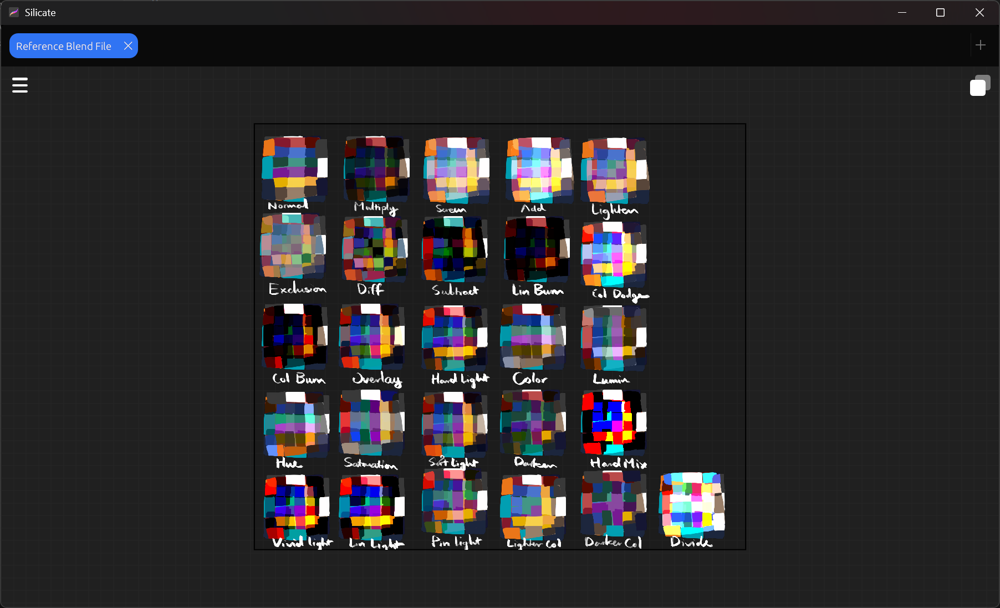
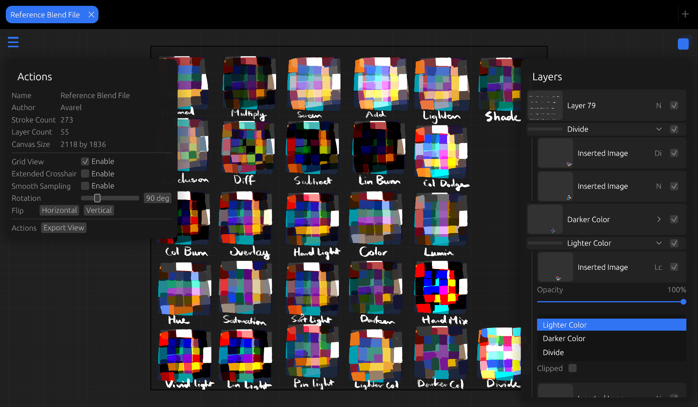

# Silicate - Procreate File Renderer

<p align="center">
  
  
</p>

This is the repository for Silicate, a GPU-accelerated, cross-platform native/web viewer for [`.procreate` files](https://procreate.com/).

## Getting Started
* Cutting-edge web viewer is available [here](https://avarel.github.io/silicate/).
* Stable native builds are available through the [Releases page](https://github.com/Avarel/silicate/releases).
  * Same macOS note applies as above.
* Cutting-edge native builds are available through the [CI pipeline](https://github.com/Avarel/silicate/actions/).
  * Download the `release-{insert your OS here}` zip and unpack to obtain the binary.
    * macOS users: You will need to unpack the zip and the dmg file to access
      the binary. You might also need to go to System Preferences and allow the
      application to run, since there is no code signing.
    * Alternatively, you can remove the quarantine attribute with the following command:
      `xattr -d com.apple.quarantine <file_path>`

Don't have a Procreate file? There is a `reference.procreate` file in the base directory for you to try.

## Features
* Native desktop app for Windows, macOS, and Linux, and a [web viewer](https://avarel.github.io/silicate/) for modern browsers.
  * Load and view multiple `.procreate` files at once.
  * Drag and drop loading.
  * Export `.procreate` files to `png`, `jpeg`, `tga`, `tiff`, `webp`, `bmp` formats.
* Change layer settings and live-preview the final result.
  * Supports blending modes, clipping masks, masks, opacity, hiding, and groups.
* UI inspired by Procreate's own app.
* GPU rendering, leveraging cross-platform `wgpu` integration.
  * Rotate and flip the canvas at orthogonal angles and orientations.
  * Rotate the view arbitrarily.
  * Smooth or pixelated sampling in the viewer.

## Notes
### Web Viewer
The [web viewer](https://avarel.github.io/silicate/) only works on modern browsers that support WebGPU and WebAssembly. It is also significantly slower than the native viewer due to the additional overhead of the web environment and single-threaded execution. Unlike the native viewer, the web viewer does not support exporting for now.

Compositing is driven by the UI thread, which means that the compositor will
block the UI thread. This is not a problem for the native viewer, as the
compositor runs on its own thread. However, for the web viewer, this means
that the UI can be unresponsive during compositing for large files.

In addition, the web viewer cannot leverage multithreaded decoding of the
Procreate file, which makes larger files take a longer time to load.

### Accuracy
The renderer produces slightly different results from the reference render by
Procreate's engine. The compositor produces accurate blending results except for
`Saturation` and `Hue`, both of which resembles Photoshop's blending style instead
of the style used by Procreate.

### Efficiency
The compositor is relatively modular, but it is completely written from scratch
with no reference to existing research. If you are willing to contribute
improvements to the existing design or design a completely new compositor,
feel free to do so.

## Procreate File Format
All `.procreate` files are standard ZIP files with the following structure.
```
- {UUID} [Folder]
  - Contains .chunk files, presumably the actual pixel canvas data for the document.
- QuickLook [Folder]
  - Thumbnail.png - Low-quality screenshot generated by Procreate.
- video [Folder]
  - segments [Folder]
    - segment-X.mp4, where X is a number starting from 1.
- Document.archive - NSKeyedArchive containing layer information along with other document information like canvas size.
```

### NS Keyed Archive
This is Apple's format for serializing Objective-C/Swift instances. It is basically
a giant dictionary containing 4 items:
* `version` - Irrelevant
* `archiver` - Irrelevant
* `top` - Top-level structure of the instance.
  * In this case, we are interested in the SilicaDocument instance.
  * It contains a plethora of key-value pairs that will not be enumerated here.
    However, the structure is interesting. The key is a simple string, and
    the value is oftentimes an `id` index that points to an object in `objects`.
  * This object in `objects` is the true value of that key.
* `objects` - The universe of values used in the archive.

### Raster Canvas Data
Each layer in a Procreate file has a `uuid` associated with it. It's raw RGBA data is located
under `{uuid}/`. The folder contain chunks with the naming convention `{col}~{row}.chunk`,
which are `tile_size * tile_size` raw RGBA data that has been compressed with LZO.
Recombine these chunks together to obtain the raw layer data.
* It is important to note that the raw layer data is **premultiplied** RGBA.

## Attribution
* [Silica Viewer](https://git.sr.ht/~redstrate/silica-viewer) Base code for understanding the Procreate format.
* [Prospect](https://github.com/jaromvogel/prospect) Another Procreate viewer, but only final composite. Supports timelapse playback.
